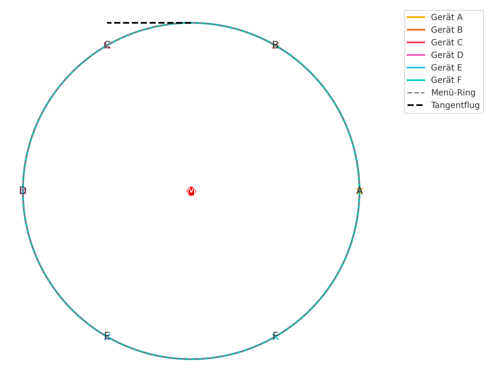

# Raeuberbude

This project was generated using [Angular CLI](https://github.com/angular/angular-cli) version 20.0.1.

# Projektbuch: Angular Home Assistant Dashboard – "Räuberbude"

## Überblick
Ziel des Projekts ist es, ein modernes, leichtgewichtiges Dashboard zur Steuerung und Visualisierung von Home Assistant Entitäten mit Angular 20 (Standalone) zu erstellen. Das Projekt wird modular aufgebaut und vermeidet klassische Angular-Module zugunsten von Standalone-Komponenten.

---

## Was haben wir gemacht?

### 1. Projektinitialisierung
- Projekt mit Angular 20 erstellt
- Standalone-Modus verwendet (`--standalone`, keine NgModules)
- SCSS als Stylesprache gewählt
- Routing aktiviert
- Angular Material eingebunden

### 2. Struktur geschaffen
- Ordnerstruktur definiert: `core/`, `features/`, `app.config.ts`, `app.routes.ts`
- `HomeAssistantService`-Service erstellt zur Kommunikation mit der Home Assistant API
- Proxy-Konfiguration zur Umgehung von CORS eingerichtet

### 3. Erste Funktion umgesetzt
- `LampToggleComponent` entwickelt
  - Steuert eine neue Lampe `light.wiz_tunable_white_640190`
  - Liest Status über REST API (`/api/states/...`)
  - Schaltet per POST über `/api/services/light/turn_on|off`

### 4. Fehler behoben
- `HttpClient`-Bereitstellung auf `provideHttpClient()` umgestellt (modern)
- CORS-Probleme durch `proxy.conf.json` mit `/api`-Rewrite gelöst
- Standalone-Komponenten korrekt mit Imports und Routing integriert
- Fehlerbehandlung beim Lampenschalter verbessert (subscribe mit next/error)
- **Login & Routing:** Einfache Benutzeranmeldung mit Weiterleitung nach `/zuhause`; Inhalte der bisherigen Startseite liegen nun unter `/raub1`, das Dashboard ist zusätzlich über `/raub2` erreichbar.

---

## Warum haben wir das so gemacht?

- **Standalone-Struktur:** spart Boilerplate, klarere Imports, schnellere Navigation zwischen Komponenten
- **Proxy-Lösung:** eleganter, sicherer Entwicklungsweg ohne Home Assistant direkt anzupassen
- **Trennung in `core/` und `features/`** hilft bei Erweiterbarkeit (z. B. zusätzliche Entitäten, Räume, Sensoren)
- **Material UI:** für saubere, einheitliche Oberfläche ohne viel Eigenaufwand

---

## Was ist wichtig zu wissen / merken?

- Alle API-Aufrufe nutzen `/api/...` (durch Angular Proxy umgeschrieben)
- Token liegt aktuell noch im `environment.ts` – später sicherer handhaben
- App läuft vollständig standalone, `AppComponent` bootstrapped direkt (`bootstrapApplication()`)
- Kein klassisches `AppModule` oder `NgModule` nötig
- Default-Login: `admin` / `secret` (lokale Demo-Datenbank)

---

## Was haben wir bereits erreicht?

- ✅ Projektstruktur und Konfiguration
- ✅ Verbindung zu Home Assistant funktioniert
- ✅ Erster Schalter (Lampe) ist sichtbar und steuerbar
- ✅ Proxy für CORS eingerichtet und stabil
- ✅ Routing funktioniert standalone
- ✅ Material-Design eingebunden

---

## Was ist der nächste Schritt?

### Konzeptphase: Struktur der "Räuberbude"

Wir planen die Startseite als eine Art **visuelles Geräte-Dashboard**:
- Jede Gerätegruppe (Fernseher, PC, Laptop, Lampe, Handy) erscheint als **Kachel** auf der Startseite
- Klick auf eine Kachel:
  - vergrößert die Kachel dynamisch (andere weichen zur Seite)
  - zeigt Detailsteuerung und Statusinformationen

### Gerätegruppen (erkannt in der Wohnung):
- 📺 Fernseher (HA-Media-Entity)
- 🖥️ PC (evtl. Switch/Sensor)
- 💻 Laptop (Tracker + evtl. WOL)
- 💡 Lampe (bereits integriert)
- 📱 Handy (Tracker, Batterie, Charger, Schlaf-Status etc.)

### Technisch umsetzbar als:
- [ ] `DeviceGroupComponent`: Wiederverwendbare Komponente für eine Gruppe
- [ ] `DashboardHomeComponent`: Layout mit Grid oder flexibler Anordnung
- [ ] Dynamische Kachelgrößen mit Animation (z. B. über Angular Animations + CSS Grid)
- [ ] Routing optional für Details oder reaktiv eingeblendet

### UI-Ideen:
- Startansicht: 5 Kacheln in Reihe/Spalten-Layout
- Bei Klick auf Gerät: zoomt in den Fokus (andere verkleinern oder blenden aus)
- Später auch Drag & Drop oder responsive Anpassung je nach Bildschirmgröße

---

## Aufgabenplan für Umsetzung
- [ ] `DashboardHomeComponent` mit Grid/Kacheln erstellen
- [ ] `DeviceGroupComponent` (z. B. mit `@Input()` für Icon, Name, Entitäten)
- [ ] Click-Verhalten definieren: Gerät fokussieren/vergrößern
- [ ] Erste Geräte einbinden: Fernseher, PC, Laptop, Lampe, Handy
- [ ] Styles & Animationen definieren (Responsivität & Fokuswechsel)
- [ ] Detailanzeige bei Klick (Popup oder Inline)

---

*Letzte Aktualisierung: 2025-06-05*

## Tests

Um die Unit-Tests auszuführen, wird ein Chrome- bzw. Chromium-Browser benötigt. Sollte die automatische Suche fehlschlagen, kann der Pfad über die Umgebungsvariable `CHROME_BIN` gesetzt werden:

```bash
CHROME_BIN=/pfad/zu/chromium npm test
```

## Animation

