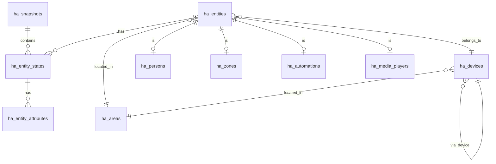

# HomeAssistant Database Design

## Übersicht
Stabiles Datenbankmodell für HomeAssistant-Daten mit Historisierung und flexibler Attributspeicherung.

## Haupttabellen

### 1. **ha_snapshots**
Haupttabelle für Import-Snapshots
```sql
- id: UUID (PK)
- timestamp: DateTime (Import-Zeitstempel)
- ha_version: String
- import_date: DateTime (wann importiert)
- status: ENUM('pending', 'processing', 'completed', 'failed')
- error_log: Text (nullable)
```

### 2. **ha_entities**
Zentrale Entitätstabelle
```sql
- id: UUID (PK)
- entity_id: String (UNIQUE) - z.B. "sensor.pixel_8_pro_battery_level"
- entity_type: ENUM('sensor', 'binary_sensor', 'light', 'switch', 'zone', 'script', 'input_boolean', 'input_number', 'input_select', 'person', 'number', 'select', 'device_tracker', 'media_player', 'automation')
- domain: String - extrahiert aus entity_id
- object_id: String - extrahiert aus entity_id
- friendly_name: String
- device_id: UUID (FK -> ha_devices, nullable)
- area_id: UUID (FK -> ha_areas, nullable)
- created_at: DateTime
- updated_at: DateTime
```

### 3. **ha_entity_states**
Zustandsdaten (historisiert)
```sql
- id: UUID (PK)
- entity_id: UUID (FK -> ha_entities)
- snapshot_id: UUID (FK -> ha_snapshots)
- state: String
- state_class: String (nullable)
- last_changed: DateTime
- last_updated: DateTime
- created_at: DateTime
```

### 4. **ha_entity_attributes**
Flexible Attributspeicherung (EAV-Pattern)
```sql
- id: UUID (PK)
- entity_state_id: UUID (FK -> ha_entity_states)
- attribute_key: String (INDEX)
- attribute_value: JSONB
- attribute_type: ENUM('string', 'number', 'boolean', 'array', 'object')
- created_at: DateTime
```

### 5. **ha_devices**
Geräteinformationen
```sql
- id: UUID (PK)
- device_id: String (UNIQUE)
- name: String
- manufacturer: String (nullable)
- model: String (nullable)
- sw_version: String (nullable)
- configuration_url: String (nullable)
- connections: JSONB (Array of connection types)
- identifiers: JSONB (Array of identifiers)
- via_device_id: UUID (FK -> ha_devices, nullable)
- area_id: UUID (FK -> ha_areas, nullable)
- created_at: DateTime
- updated_at: DateTime
```

### 6. **ha_areas**
Raum-/Bereichsdefinitionen
```sql
- id: UUID (PK)
- area_id: String (UNIQUE)
- name: String
- aliases: JSONB (Array of strings)
- floor: String (nullable)
- icon: String (nullable)
- created_at: DateTime
- updated_at: DateTime
```

### 7. **ha_services**
Service-Definitionen
```sql
- id: UUID (PK)
- domain: String (z.B. 'homeassistant', 'light')
- service_name: String (z.B. 'turn_on')
- full_name: String (domain.service_name)
- description: Text
- fields: JSONB (Parameter-Definition)
- target: JSONB (Erlaubte Ziele)
- response_optional: Boolean
- created_at: DateTime
- updated_at: DateTime
```

### 8. **ha_persons**
Personen-Spezifische Daten
```sql
- id: UUID (PK)
- entity_id: UUID (FK -> ha_entities)
- person_id: String (UNIQUE)
- name: String
- user_id: String (nullable)
- device_trackers: JSONB (Array of entity_ids)
- latitude: Float (nullable)
- longitude: Float (nullable)
- gps_accuracy: Float (nullable)
- created_at: DateTime
- updated_at: DateTime
```

### 9. **ha_zones**
Zonen-Details
```sql
- id: UUID (PK)
- entity_id: UUID (FK -> ha_entities)
- zone_name: String
- latitude: Float
- longitude: Float
- radius: Float
- passive: Boolean
- persons: JSONB (Array of person_ids)
- icon: String (nullable)
- created_at: DateTime
- updated_at: DateTime
```

### 10. **ha_automations**
Automation-Details
```sql
- id: UUID (PK)
- entity_id: UUID (FK -> ha_entities)
- automation_id: String (UNIQUE)
- alias: String
- description: Text (nullable)
- mode: ENUM('single', 'restart', 'queued', 'parallel')
- current: Integer
- max: Integer (nullable)
- triggers: JSONB
- conditions: JSONB
- actions: JSONB
- created_at: DateTime
- updated_at: DateTime
```

### 11. **ha_media_players**
Media Player spezifische Daten
```sql
- id: UUID (PK)
- entity_id: UUID (FK -> ha_entities)
- volume_level: Float (nullable)
- is_volume_muted: Boolean
- media_content_type: String (nullable)
- media_title: String (nullable)
- media_artist: String (nullable)
- group_members: JSONB (Array of entity_ids)
- created_at: DateTime
- updated_at: DateTime
```

## Indizes

```sql
-- Performance-Indizes
CREATE INDEX idx_entities_type ON ha_entities(entity_type);
CREATE INDEX idx_entities_domain ON ha_entities(domain);
CREATE INDEX idx_states_entity_snapshot ON ha_entity_states(entity_id, snapshot_id);
CREATE INDEX idx_states_timestamp ON ha_entity_states(last_updated);
CREATE INDEX idx_attributes_key ON ha_entity_attributes(attribute_key);
CREATE INDEX idx_attributes_state ON ha_entity_attributes(entity_state_id);
CREATE INDEX idx_devices_area ON ha_devices(area_id);
CREATE INDEX idx_entities_device ON ha_entities(device_id);
CREATE INDEX idx_entities_area ON ha_entities(area_id);

-- Volltext-Suche
CREATE INDEX idx_entities_friendly_name ON ha_entities USING gin(to_tsvector('german', friendly_name));
```

## Beziehungen



## Datenimport-Strategie

1. **Snapshot erstellen** (ha_snapshots)
2. **Areas importieren** (ha_areas)
3. **Devices importieren** (ha_devices)
4. **Entities importieren** (ha_entities)
5. **Entity States mit Attributes** (ha_entity_states, ha_entity_attributes)
6. **Spezifische Tabellen füllen** (ha_persons, ha_zones, etc.)
7. **Services importieren** (ha_services)

## Vorteile dieses Modells

- **Flexibilität**: EAV-Pattern für Attribute ermöglicht beliebige Erweiterungen
- **Historisierung**: Vollständige Historie über Snapshots
- **Performance**: Gezielt gesetzte Indizes
- **Normalisierung**: Redundanzen vermieden
- **Erweiterbarkeit**: Neue Entity-Typen einfach hinzufügbar
- **Beziehungen**: Klare Relationen zwischen Entities, Devices und Areas
