# Entity-Beziehungsdiagramm (PoC-Scope)

**Projekt:** Raeuberbude - TypeORM Schema  
**Ticket:** LUD28-59 (DBM-SCHEMA-03)  
**Stand:** 2025-12-03 (Draft nach LUD28-59.1)

---

## 🎨 Visuelle Übersicht

```mermaid
erDiagram
    %% Auth & Permissions
    User ||--o| UserRights : "1:1 has"
    User ||--o{ SpeechHumanInput : "1:n created"
    User ||--o{ SpeechTranscript : "1:n created"
    User ||--o{ EventLog : "1:n has"
    
    UserRights ||--o{ UserAllowedTerminal : "1:n allows"
    AppTerminal ||--o{ UserAllowedTerminal : "1:n allows"
    
    %% Terminals & Speech
    AppTerminal ||--o| TerminalRights : "1:1 has"
    AppTerminal ||--o{ SpeechHumanInput : "1:n receives"
    AppTerminal ||--o{ SpeechTranscript : "1:n logs"
    AppTerminal ||--o{ IntentLog : "1:n logs"
    User ||--o{ AppTerminal : "1:n assigned"
    
    %% Logging & Kategorisierung
    Category ||--o{ IntentLog : "1:n categorizes"
    Category ||--o{ SpeechTranscript : "1:n categorizes"
    
    SpeechTranscript }o--|| HaArea : "n:1 references"
    SpeechTranscript }o--|| HaEntity : "n:1 references"
    
    %% HomeAssistant Core
    HaSnapshot ||--o{ HaEntityState : "1:n contains"
    HaEntity ||--o{ HaEntityState : "1:n has"
    HaEntityState ||--o{ HaEntityAttribute : "1:n has"
    
    HaArea ||--o{ HaDevice : "1:n contains"
    HaArea ||--o{ HaEntity : "1:n contains"
    
    HaDevice ||--o{ HaEntity : "1:n contains"
    HaDevice ||--o| HaDevice : "self-ref via_device"
    
    %% Attribute Definitions
    User {
        uuid id PK
        string username UK
        string email UK
        string password_hash
        jsonb profile_data
        timestamp created_at
        timestamp updated_at
    }
    
    UserRights {
        uuid user_id PK,FK
        enum role
        enum status
        timestamp expires_at
        jsonb permissions_json
        boolean can_use_speech_input
        boolean can_view_own_inputs
        boolean can_view_all_inputs
        boolean can_delete_inputs
        boolean can_manage_terminals
        boolean can_manage_users
        jsonb metadata
        timestamp created_at
        timestamp updated_at
    }
    
    AppTerminal {
        uuid id PK
        string terminal_id UK
        string name
        text description
        enum type
        text location
        jsonb capabilities_json
        enum status
        timestamp last_active_at
        uuid assigned_user_id FK
        jsonb allowed_actions_json
        jsonb settings_json
        jsonb metadata_json
        timestamp created_at
        timestamp updated_at
    }
    
    TerminalRights {
        uuid terminal_id PK,FK
        string role_key
        enum status
        jsonb allowed_actions_json
        jsonb restrictions_json
        jsonb metadata_json
        timestamp created_at
        timestamp updated_at
    }
    
    SpeechHumanInput {
        uuid id PK
        uuid user_id FK
        uuid terminal_id FK
        text text
        string language
        float confidence
        jsonb metadata
        timestamp created_at
        timestamp updated_at
    }
    
    SpeechTestInput {
        uuid id PK
        uuid user_id FK
        text text
        text expected_intent
        text actual_intent
        boolean passed
        jsonb metadata
        timestamp created_at
        timestamp updated_at
    }
    
    Category {
        uuid id PK
        string key UK
        string label
        text description
        timestamp created_at
    }
    
    IntentLog {
        uuid id PK
        timestamp timestamp
        text transcript
        string intent_key
        text summary
        jsonb keywords_json
        float confidence
        uuid terminal_id FK
        uuid category_id FK
        timestamp created_at
    }
    
    SpeechTranscript {
        uuid id PK
        uuid user_id FK
        uuid terminal_id FK
        uuid category_id FK
        text transcript
        text recognized_intent
        float confidence
        string assigned_area_id FK
        string assigned_entity_id FK
        jsonb metadata
        timestamp created_at
        timestamp updated_at
    }
    
    EventLog {
        uuid id PK
        timestamp timestamp
        enum type
        text message
        uuid user_id FK
        jsonb metadata
        timestamp created_at
    }
    
    HaSnapshot {
        uuid id PK
        timestamp timestamp
        string ha_version
        timestamp import_date
        enum status
        text error_log
        timestamp created_at
    }
    
    HaArea {
        uuid id PK
        string area_id UK
        string name
        jsonb aliases
        string floor
        string icon
        timestamp created_at
        timestamp updated_at
    }
    
    HaDevice {
        uuid id PK
        string device_id UK
        string name
        string manufacturer
        string model
        string sw_version
        string configuration_url
        jsonb connections
        jsonb identifiers
        string via_device_id FK
        string area_id FK
        timestamp created_at
        timestamp updated_at
    }
    
    HaEntity {
        uuid id PK
        string entity_id UK
        enum entity_type
        string domain
        string object_id
        string friendly_name
        string device_id FK
        string area_id FK
        timestamp created_at
        timestamp updated_at
    }
    
    HaEntityState {
        uuid id PK
        string entity_id FK
        uuid snapshot_id FK
        string state
        string state_class
        timestamp last_changed
        timestamp last_updated
        timestamp created_at
    }
    
    HaEntityAttribute {
        uuid id PK
        uuid entity_state_id FK
        string attribute_key
        jsonb attribute_value
        enum attribute_type
        timestamp created_at
    }
    
    UserAllowedTerminal {
        uuid user_id PK,FK
        uuid terminal_id PK,FK
        timestamp granted_at
    }
```

---

## 📊 Domänen-Statistik

| Domäne | Entities | Beziehungen | Tabellen |
|--------|----------|-------------|----------|
| **Auth & Permissions** | 3 | 5 | `users`, `user_rights`, `user_allowed_terminals` |
| **Terminals & Speech** | 4 | 7 | `app_terminals`, `terminal_rights`, `speech_human_inputs`, `speech_test_inputs` |
| **Logging** | 4 | 6 | `categories`, `intent_logs`, `speech_transcripts`, `event_logs` |
| **HomeAssistant** | 7 | 11 | `ha_snapshots`, `ha_areas`, `ha_devices`, `ha_entities`, `ha_entity_states`, `ha_entity_attributes` |
| **Gesamt (PoC)** | **18** | **29** | **18 Tabellen** |

---

## 🔗 Beziehungstypen

### 1:1 Beziehungen (2)
- `User` ↔ `UserRights`
- `AppTerminal` ↔ `TerminalRights`

### 1:n Beziehungen (23)
- `User` → `SpeechHumanInput`
- `User` → `SpeechTranscript`
- `User` → `EventLog`
- `User` → `AppTerminal` (assigned)
- `AppTerminal` → `SpeechHumanInput`
- `AppTerminal` → `SpeechTranscript`
- `AppTerminal` → `IntentLog`
- `Category` → `IntentLog`
- `Category` → `SpeechTranscript`
- `HaSnapshot` → `HaEntityState`
- `HaEntity` → `HaEntityState`
- `HaEntityState` → `HaEntityAttribute`
- `HaArea` → `HaDevice`
- `HaArea` → `HaEntity`
- `HaDevice` → `HaEntity`
- `HaDevice` → `HaDevice` (self-ref via_device)
- (weitere 7 optionale Beziehungen für Transcripts zu HA)

### n:m Beziehungen (1)
- `User` ↔ `AppTerminal` (via `user_allowed_terminals`)

### EAV-Pattern (1)
- `HaEntityState` → `HaEntityAttribute` (flexible Attributspeicherung)

---

## 🎯 Wichtige Constraints

### Unique-Constraints (10)
- `users.username`
- `users.email`
- `app_terminals.terminal_id`
- `categories.key`
- `ha_areas.area_id`
- `ha_devices.device_id`
- `ha_entities.entity_id`
- `ha_entity_states.(entity_id, snapshot_id)` (zusammengesetzt)
- `user_allowed_terminals.(user_id, terminal_id)` (PK)

### Foreign Key Constraints (24)
- Auth: 4 FKs
- Terminals: 3 FKs
- Logging: 6 FKs
- HomeAssistant: 11 FKs

### Indizes (30+)
- Primary Keys: 18
- Unique-Indizes: 10
- Foreign Key Indizes: 24
- Zusätzliche Indizes (Timestamps, Enums): 15+

---

## 🔍 Besondere Merkmale

### Soft-Delete-Ready
Alle Entities haben `created_at` und `updated_at` → einfache Erweiterung um `deleted_at` möglich

### Audit-Trail-Ready
UUID-PKs erlauben einfache Integration von Audit-Tabellen

### Privacy-Compliant
Logging-Tabellen haben nullable `user_id` → Pseudonymisierung/Anonymisierung möglich

### Historisierung
- `HaSnapshot` → `HaEntityState` erlaubt Zeitreihen-Analysen
- EAV-Modell für flexible HA-Attribute

### Performance-Optimiert
- Indizes auf allen FKs
- Zusammengesetzte Indizes auf häufigen Queries
- JSONB für flexible Daten (PostgreSQL)

---

## 📝 Nächste Schritte (Phase 2)

### Fehlende Entities (Full Scope)
- [ ] `HaService` (Service-Definitionen)
- [ ] `HaPerson` (Personen + Device Tracker)
- [ ] `HaZone` (Zonen)
- [ ] `HaZonePerson` (M:N)
- [ ] `HaMediaPlayer` (Media Player)
- [ ] `HaMediaPlayerGroupMember` (M:N self-ref)
- [ ] `HaAutomation` (Automationen)
- [ ] `UserRole` (Rollen-Dimensionstabelle)
- [ ] `UserPermission` (Permissions-Dimensionstabelle)
- [ ] `LlmInstance` (LLM-Konfigurationen)

### Erweiterte Beziehungen
- [ ] `UserRole` ↔ `UserPermission` (M:N)
- [ ] `UserRights` → `UserRole`
- [ ] `HaZone` ↔ `HaPerson` (M:N)
- [ ] `HaMediaPlayer` ↔ `HaMediaPlayer` (self M:N für Gruppen)

---

**Generiert:** 2025-12-03  
**Tool:** Mermaid ER-Diagramm  
**Status:** Draft (basiert auf DBM-SCHEMA-03 v0.1)  
**Nächstes Update:** Nach LUD28-59.2 (Design-Phase)

