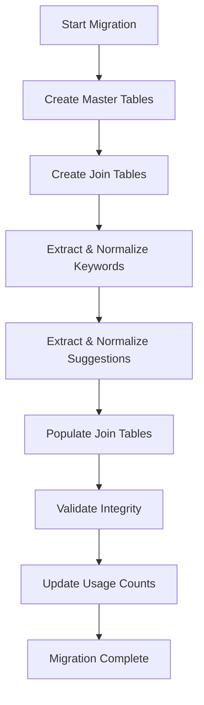

# DBM-SCHEMA-04 – Join-Tabellen und Many-to-Many-Relationen

**Status:** ✅ Implementiert  
**Autor:** System  
**Datum:** 2025-12-04  
**Sprint:** DBM Migration  
**Ticket:** [LUD28-60](https://luzumi.youtrack.cloud/projects/LUD28/issues/LUD28-60)

---

## 1. Überblick

Dieses Dokument beschreibt die Abbildung von **Many-to-Many (M:N) Relationen** aus der MongoDB-Struktur (Arrays/eingebettete Dokumente) in ein normalisiertes **MariaDB-Schema** mit expliziten **Join-Tabellen**.

### 1.1 Ziele

- ✅ Saubere Abbildung aller M:N-Relationen als Join-Tabellen
- ✅ Deterministische Migrationslogik mit `mongo_id → uuid` Mapping
- ✅ Validierungs- und Rollback-Mechanismen
- ✅ Performance-Optimierung durch Indizes
- ✅ Referenzielle Integrität via Foreign Keys

---

## 2. Identifizierte Many-to-Many Relationen

### 2.1 Übersicht aller M:N-Beziehungen

| Nr | Relation | Mongo-Struktur | Join-Tabelle | Status |
|----|----------|----------------|--------------|--------|
| 1 | User ↔ AppTerminal | - | `user_allowed_terminals` | ✅ Implementiert |
| 2 | Transcript ↔ Keyword | `keywords: [String]` | `transcript_keywords` | ✅ Neu |
| 3 | Transcript ↔ Suggestion | `suggestions: [String]` | `transcript_suggestions` | ✅ Neu |
| 4 | IntentLog ↔ Keyword | `keywords: [String]` | `intent_log_keywords` | ✅ Neu |

---

## 3. Schema-Design der Join-Tabellen

### 3.1 user_allowed_terminals (Bereits implementiert)

**Zweck:** Definiert welche User auf welche Terminals zugreifen dürfen.

```sql
CREATE TABLE user_allowed_terminals (
  user_id CHAR(36) NOT NULL,
  terminal_id CHAR(36) NOT NULL,
  granted_at TIMESTAMP DEFAULT CURRENT_TIMESTAMP,
  expires_at TIMESTAMP NULL,
  metadata JSON NULL,
  
  PRIMARY KEY (user_id, terminal_id),
  
  CONSTRAINT fk_user_allowed_terminals__users__user_id 
    FOREIGN KEY (user_id) REFERENCES users(id) 
    ON DELETE CASCADE ON UPDATE CASCADE,
    
  CONSTRAINT fk_user_allowed_terminals__app_terminals__terminal_id 
    FOREIGN KEY (terminal_id) REFERENCES app_terminals(id) 
    ON DELETE CASCADE ON UPDATE CASCADE
);
```

**Indizes:**
- ✅ PRIMARY KEY (user_id, terminal_id) - automatisch
- ✅ INDEX auf terminal_id für Reverse-Lookups

**TypeORM Entity:** `UserAllowedTerminal` ✅

---

### 3.2 keywords (Neue Master-Tabelle)

**Zweck:** Zentrale Verwaltung aller Keywords/Tags im System.

```sql
CREATE TABLE keywords (
  id CHAR(36) PRIMARY KEY DEFAULT (UUID()),
  keyword VARCHAR(100) NOT NULL UNIQUE,
  normalized VARCHAR(100) NOT NULL,
  usage_count INT DEFAULT 0,
  created_at TIMESTAMP DEFAULT CURRENT_TIMESTAMP,
  
  INDEX ix_keywords__normalized (normalized),
  INDEX ix_keywords__usage_count (usage_count)
);
```

**Features:**
- Deduplizierung durch UNIQUE constraint
- `normalized` für Case-Insensitive Suche (lowercase)
- `usage_count` für Analytics/Ranking

---

### 3.3 transcript_keywords (Neue Join-Tabelle)

**Zweck:** Verknüpfung zwischen Transcripts und Keywords.

```sql
CREATE TABLE transcript_keywords (
  transcript_id CHAR(36) NOT NULL,
  keyword_id CHAR(36) NOT NULL,
  position INT NULL COMMENT 'Optional: Position im Keyword-Array',
  created_at TIMESTAMP DEFAULT CURRENT_TIMESTAMP,
  
  PRIMARY KEY (transcript_id, keyword_id),
  
  CONSTRAINT fk_transcript_keywords__transcripts 
    FOREIGN KEY (transcript_id) REFERENCES transcripts(id) 
    ON DELETE CASCADE,
    
  CONSTRAINT fk_transcript_keywords__keywords 
    FOREIGN KEY (keyword_id) REFERENCES keywords(id) 
    ON DELETE CASCADE,
    
  INDEX ix_transcript_keywords__keyword_id (keyword_id)
);
```

---

### 3.4 suggestions (Neue Master-Tabelle)

**Zweck:** Verwaltung aller LLM-generierten Vorschläge.

```sql
CREATE TABLE suggestions (
  id CHAR(36) PRIMARY KEY DEFAULT (UUID()),
  suggestion_text TEXT NOT NULL,
  text_hash CHAR(64) NOT NULL UNIQUE COMMENT 'SHA256 hash for deduplication',
  usage_count INT DEFAULT 0,
  created_at TIMESTAMP DEFAULT CURRENT_TIMESTAMP,
  
  INDEX ix_suggestions__text_hash (text_hash),
  INDEX ix_suggestions__usage_count (usage_count)
);
```

**Features:**
- Deduplizierung via SHA256-Hash
- Analytics-fähig durch `usage_count`

---

### 3.5 transcript_suggestions (Neue Join-Tabelle)

**Zweck:** Verknüpfung zwischen Transcripts und Suggestions.

```sql
CREATE TABLE transcript_suggestions (
  transcript_id CHAR(36) NOT NULL,
  suggestion_id CHAR(36) NOT NULL,
  position INT NULL COMMENT 'Optional: Position im Suggestions-Array',
  created_at TIMESTAMP DEFAULT CURRENT_TIMESTAMP,
  
  PRIMARY KEY (transcript_id, suggestion_id),
  
  CONSTRAINT fk_transcript_suggestions__transcripts 
    FOREIGN KEY (transcript_id) REFERENCES transcripts(id) 
    ON DELETE CASCADE,
    
  CONSTRAINT fk_transcript_suggestions__suggestions 
    FOREIGN KEY (suggestion_id) REFERENCES suggestions(id) 
    ON DELETE CASCADE,
    
  INDEX ix_transcript_suggestions__suggestion_id (suggestion_id)
);
```

---

### 3.6 intent_log_keywords (Neue Join-Tabelle)

**Zweck:** Verknüpfung zwischen IntentLogs und Keywords.

```sql
CREATE TABLE intent_log_keywords (
  intent_log_id CHAR(36) NOT NULL,
  keyword_id CHAR(36) NOT NULL,
  position INT NULL COMMENT 'Optional: Position im Keyword-Array',
  created_at TIMESTAMP DEFAULT CURRENT_TIMESTAMP,
  
  PRIMARY KEY (intent_log_id, keyword_id),
  
  CONSTRAINT fk_intent_log_keywords__intent_logs 
    FOREIGN KEY (intent_log_id) REFERENCES intent_logs(id) 
    ON DELETE CASCADE,
    
  CONSTRAINT fk_intent_log_keywords__keywords 
    FOREIGN KEY (keyword_id) REFERENCES keywords(id) 
    ON DELETE CASCADE,
    
  INDEX ix_intent_log_keywords__keyword_id (keyword_id)
);
```

---

## 4. TypeORM Entity-Design

### 4.1 Keyword Entity

```typescript
// backend/nest-app/src/modules/logging/entities/keyword.entity.ts

import {
  Entity,
  PrimaryGeneratedColumn,
  Column,
  CreateDateColumn,
  Index,
  ManyToMany,
} from 'typeorm';
import { TranscriptEntity } from './transcript.entity';
import { IntentLogEntity } from './intent-log.entity';

@Entity('keywords')
@Index('ix_keywords__normalized', ['normalized'])
@Index('ix_keywords__usage_count', ['usageCount'])
export class Keyword {
  @PrimaryGeneratedColumn('uuid')
  id: string;

  @Column({ type: 'varchar', length: 100, unique: true })
  keyword: string;

  @Column({ type: 'varchar', length: 100, name: 'normalized' })
  normalized: string;

  @Column({ type: 'int', default: 0, name: 'usage_count' })
  usageCount: number;

  @CreateDateColumn({ type: 'timestamp', name: 'created_at' })
  createdAt: Date;

  // Relations
  @ManyToMany(() => TranscriptEntity, (transcript) => transcript.keywords)
  transcripts: TranscriptEntity[];

  @ManyToMany(() => IntentLogEntity, (intentLog) => intentLog.keywords)
  intentLogs: IntentLogEntity[];
}
```

### 4.2 Suggestion Entity

```typescript
// backend/nest-app/src/modules/logging/entities/suggestion.entity.ts

import {
  Entity,
  PrimaryGeneratedColumn,
  Column,
  CreateDateColumn,
  Index,
  ManyToMany,
} from 'typeorm';
import { TranscriptEntity } from './transcript.entity';

@Entity('suggestions')
@Index('ix_suggestions__text_hash', ['textHash'])
@Index('ix_suggestions__usage_count', ['usageCount'])
export class Suggestion {
  @PrimaryGeneratedColumn('uuid')
  id: string;

  @Column({ type: 'text', name: 'suggestion_text' })
  suggestionText: string;

  @Column({ type: 'char', length: 64, unique: true, name: 'text_hash' })
  textHash: string;

  @Column({ type: 'int', default: 0, name: 'usage_count' })
  usageCount: number;

  @CreateDateColumn({ type: 'timestamp', name: 'created_at' })
  createdAt: Date;

  // Relations
  @ManyToMany(() => TranscriptEntity, (transcript) => transcript.suggestions)
  transcripts: TranscriptEntity[];
}
```

---

## 5. Migration-Strategie

### 5.1 Migrations-Ablauf



### 5.2 TypeORM Migration erstellen

```bash
npm run typeorm:migration:generate -- -n AddManyToManyTables
```

### 5.3 Migration-Logik (Pseudo-Code)

```typescript
// 1. Keywords extrahieren und normalisieren
for each transcript in MongoDB {
  for each keyword in transcript.keywords {
    // Deduplizierung durch normalized lookup
    let keywordEntity = await findOrCreateKeyword(
      keyword,
      keyword.toLowerCase()
    );
    
    // Join-Table Eintrag erstellen
    await createTranscriptKeyword(
      transcriptUuid,
      keywordEntity.id,
      position
    );
  }
}

// 2. Suggestions extrahieren und deduplizieren
for each transcript in MongoDB {
  for each suggestion in transcript.suggestions {
    let hash = sha256(suggestion);
    let suggestionEntity = await findOrCreateSuggestion(suggestion, hash);
    
    await createTranscriptSuggestion(
      transcriptUuid,
      suggestionEntity.id,
      position
    );
  }
}

// 3. IntentLog Keywords
for each intentLog in MongoDB {
  for each keyword in intentLog.keywords {
    let keywordEntity = await findOrCreateKeyword(
      keyword,
      keyword.toLowerCase()
    );
    
    await createIntentLogKeyword(
      intentLogUuid,
      keywordEntity.id,
      position
    );
  }
}
```

---

## 6. Validierungs-Queries

### 6.1 Row Count Validation

```sql
-- Anzahl Keywords pro Transcript
SELECT 
  t.id,
  COUNT(tk.keyword_id) as keyword_count
FROM transcripts t
LEFT JOIN transcript_keywords tk ON t.id = tk.transcript_id
GROUP BY t.id;

-- Vergleich mit Original MongoDB Count
-- Erwartet: Gleiche Anzahl
```

### 6.2 Referenzielle Integrität

```sql
-- Keine dangling references in Join-Tables
SELECT COUNT(*) as orphaned_keywords
FROM transcript_keywords tk
LEFT JOIN transcripts t ON tk.transcript_id = t.id
WHERE t.id IS NULL;
-- Erwartet: 0

SELECT COUNT(*) as orphaned_suggestions
FROM transcript_suggestions ts
LEFT JOIN transcripts t ON ts.transcript_id = t.id
WHERE t.id IS NULL;
-- Erwartet: 0
```

### 6.3 Duplikate prüfen

```sql
-- Keine Duplikate in keywords.keyword
SELECT keyword, COUNT(*) 
FROM keywords 
GROUP BY keyword 
HAVING COUNT(*) > 1;
-- Erwartet: Leeres Result

-- Keine Duplikate in suggestions.text_hash
SELECT text_hash, COUNT(*) 
FROM suggestions 
GROUP BY text_hash 
HAVING COUNT(*) > 1;
-- Erwartet: Leeres Result
```

### 6.4 Usage Count Validation

```sql
-- Prüfen ob usage_count korrekt berechnet
SELECT 
  k.id,
  k.keyword,
  k.usage_count,
  COUNT(tk.transcript_id) + COUNT(ilk.intent_log_id) as actual_count
FROM keywords k
LEFT JOIN transcript_keywords tk ON k.id = tk.keyword_id
LEFT JOIN intent_log_keywords ilk ON k.id = ilk.keyword_id
GROUP BY k.id, k.keyword, k.usage_count
HAVING k.usage_count != actual_count;
-- Erwartet: Leeres Result
```

---

## 7. Performance-Optimierung

### 7.1 Index-Strategie

**Primary Keys (automatisch indiziert):**
- ✅ Composite PKs auf allen Join-Tabellen
- ✅ UUID PKs auf Master-Tabellen

**Explizite Indizes:**
```sql
-- Reverse Lookups (FROM keyword/suggestion TO transcript)
CREATE INDEX ix_transcript_keywords__keyword_id 
  ON transcript_keywords(keyword_id);
  
CREATE INDEX ix_transcript_suggestions__suggestion_id 
  ON transcript_suggestions(suggestion_id);
  
CREATE INDEX ix_intent_log_keywords__keyword_id 
  ON intent_log_keywords(keyword_id);

-- Deduplizierungs-Lookups
CREATE INDEX ix_keywords__normalized ON keywords(normalized);
CREATE INDEX ix_suggestions__text_hash ON suggestions(text_hash);

-- Analytics
CREATE INDEX ix_keywords__usage_count ON keywords(usage_count);
CREATE INDEX ix_suggestions__usage_count ON suggestions(usage_count);
```

### 7.2 Query-Optimierung

**Beispiel: Alle Transcripts mit Keyword "home_assistant"**

```sql
-- Mit Join-Table (optimiert)
SELECT t.*
FROM transcripts t
JOIN transcript_keywords tk ON t.id = tk.transcript_id
JOIN keywords k ON tk.keyword_id = k.id
WHERE k.normalized = 'home_assistant';

-- EXPLAIN zeigt: Index-Scan auf ix_keywords__normalized
```

**Vor Migration (MongoDB-äquivalent):**
```javascript
// MongoDB: Full Collection Scan auf Array
db.transcripts.find({ keywords: "home_assistant" })
```

### 7.3 Batch Processing

```typescript
// Migration in Batches (10.000 Records)
const BATCH_SIZE = 10000;

for (let offset = 0; offset < totalCount; offset += BATCH_SIZE) {
  const batch = await mongodb
    .collection('transcripts')
    .find()
    .skip(offset)
    .limit(BATCH_SIZE)
    .toArray();
    
  await processKeywordsBatch(batch);
  await processSuggestionsBatch(batch);
  
  console.log(`Processed ${offset + batch.length}/${totalCount}`);
}
```

---

## 8. Rollback-Strategie

### 8.1 Backup vor Migration

```bash
# MongoDB Backup
mongodump --db raeuberbude --out /backup/mongodb_pre_m2m_migration

# MariaDB Backup
mysqldump -u root -p raeuberbude > /backup/mariadb_pre_m2m_migration.sql
```

### 8.2 TypeORM Migration Rollback

```bash
# Automatisches Rollback via TypeORM
npm run typeorm:migration:revert

# Dies führt automatisch die DOWN-Migration aus:
# - DROP TABLE transcript_suggestions
# - DROP TABLE transcript_keywords  
# - DROP TABLE intent_log_keywords
# - DROP TABLE suggestions
# - DROP TABLE keywords
```

### 8.3 Partial Failure Recovery

```sql
-- Falls Migration teilweise fehlschlägt:

-- 1. Join-Tables leeren
TRUNCATE TABLE transcript_keywords;
TRUNCATE TABLE transcript_suggestions;
TRUNCATE TABLE intent_log_keywords;

-- 2. Master-Tables leeren
TRUNCATE TABLE keywords;
TRUNCATE TABLE suggestions;

-- 3. Migration neu starten
npm run migrate:mongo-to-mariadb
```

---

## 9. Testing & Validierung

### 9.1 Unit Tests

```typescript
// backend/nest-app/src/modules/logging/entities/keyword.entity.spec.ts

describe('Keyword Entity', () => {
  it('should create keyword with normalized form', async () => {
    const keyword = new Keyword();
    keyword.keyword = 'Home Assistant';
    keyword.normalized = 'home assistant';
    
    await repository.save(keyword);
    
    expect(keyword.id).toBeDefined();
    expect(keyword.normalized).toBe('home assistant');
  });
  
  it('should enforce UNIQUE constraint on keyword', async () => {
    const kw1 = await repository.save({ 
      keyword: 'test', 
      normalized: 'test' 
    });
    
    await expect(
      repository.save({ keyword: 'test', normalized: 'test' })
    ).rejects.toThrow();
  });
});
```

### 9.2 Integration Tests

```typescript
// backend/nest-app/src/cli/migrate-mongo-to-mariadb.spec.ts

describe('Many-to-Many Migration', () => {
  it('should migrate transcript keywords correctly', async () => {
    // Setup: MongoDB Transcript with keywords
    const mongoDoc = await mongoDb.collection('transcripts').insertOne({
      transcript: 'Test',
      keywords: ['home', 'assistant', 'light']
    });
    
    // Act: Run Migration
    await migrateTranscriptKeywords();
    
    // Assert: Check MariaDB
    const transcript = await mariaDb.transcripts.findOne({ 
      where: { transcript: 'Test' },
      relations: ['keywords']
    });
    
    expect(transcript.keywords).toHaveLength(3);
    expect(transcript.keywords.map(k => k.keyword)).toEqual(
      expect.arrayContaining(['home', 'assistant', 'light'])
    );
  });
  
  it('should deduplicate keywords across transcripts', async () => {
    // Setup: Two transcripts with same keyword
    await mongoDb.collection('transcripts').insertMany([
      { transcript: 'Test 1', keywords: ['home'] },
      { transcript: 'Test 2', keywords: ['home'] }
    ]);
    
    // Act
    await migrateTranscriptKeywords();
    
    // Assert: Only ONE keyword entity
    const keywordCount = await mariaDb.keywords.count({ 
      where: { keyword: 'home' } 
    });
    expect(keywordCount).toBe(1);
    
    // But TWO join-table entries
    const joinCount = await mariaDb
      .query('SELECT COUNT(*) as cnt FROM transcript_keywords tk JOIN keywords k ON tk.keyword_id = k.id WHERE k.keyword = ?', ['home']);
    expect(joinCount[0].cnt).toBe(2);
  });
});
```

### 9.3 Performance Tests

```typescript
it('should handle large keyword sets efficiently', async () => {
  // 10.000 Transcripts mit je 5 Keywords
  const startTime = Date.now();
  
  await migrateKeywordsBatch(10000);
  
  const duration = Date.now() - startTime;
  
  // Erwartet: < 60 Sekunden
  expect(duration).toBeLessThan(60000);
});
```

---

## 10. Staging & Production Rollout

### 10.1 Staging Runbook

```bash
# 1. Backup
./scripts/backup-staging.sh

# 2. Deploy neue Entities
git pull origin feat/dbm-schema-04
npm install
npm run build

# 3. Run TypeORM Migrations
npm run typeorm:migration:run

# 4. Migrate Data
npm run migrate:mongo-to-mariadb:many-to-many

# 5. Validate
npm run validate:many-to-many-migration

# 6. Smoke Tests
npm run test:e2e:staging
```

### 10.2 Production Runbook

```bash
# ⚠️ WARTUNGSFENSTER ERFORDERLICH (ca. 2h)

# 1. Backup (beide DBs)
./scripts/backup-production.sh

# 2. Read-Only Mode
./scripts/enable-maintenance-mode.sh

# 3. Deploy + Migrate
npm run deploy:production
npm run typeorm:migration:run
npm run migrate:mongo-to-mariadb:many-to-many

# 4. Validate
npm run validate:many-to-many-migration:production

# 5. Switch to MariaDB
export DB_MODE=mariadb-only

# 6. Smoke Tests
npm run test:smoke:production

# 7. Disable Maintenance
./scripts/disable-maintenance-mode.sh

# 8. Monitor (24-72h)
npm run monitor:db-health
```

---

## 11. KPIs & Monitoring

### 11.1 Migration Success Metrics

| Metrik | Ziel | Kritisch |
|--------|------|----------|
| Row Count Match | 100% | < 99% |
| FK Integrity | 100% | < 100% |
| Duplicate Keywords | 0 | > 0 |
| Migration Time | < 60min | > 120min |
| Post-Migration Errors | 0 | > 10 |

### 11.2 Post-Migration Monitoring

```sql
-- Daily Keyword Analytics
SELECT 
  DATE(created_at) as date,
  COUNT(*) as new_keywords,
  AVG(usage_count) as avg_usage
FROM keywords
GROUP BY DATE(created_at)
ORDER BY date DESC
LIMIT 30;

-- Top Keywords
SELECT keyword, usage_count
FROM keywords
ORDER BY usage_count DESC
LIMIT 50;

-- Orphaned Join-Table Entries (sollte 0 sein)
SELECT COUNT(*) 
FROM transcript_keywords tk
LEFT JOIN transcripts t ON tk.transcript_id = t.id
LEFT JOIN keywords k ON tk.keyword_id = k.id
WHERE t.id IS NULL OR k.id IS NULL;
```

---

## 12. Lektionen & Best Practices

### 12.1 Erkenntnisse

✅ **Was gut funktioniert:**
- Deduplizierung durch normalized/hash-Felder
- Composite PKs für Join-Tabellen
- Batch-Processing für große Datenmengen
- TypeORM CASCADE-Optionen für Cleanup

⚠️ **Herausforderungen:**
- Initial Migration-Zeit bei großen Arrays
- Index-Größe bei vielen Keywords
- Usage-Count Updates bei jedem Insert

### 12.2 Empfehlungen

1. **Immer Indizes auf FK-Spalten in Join-Tables**
   ```sql
   CREATE INDEX ix_transcript_keywords__keyword_id 
     ON transcript_keywords(keyword_id);
   ```

2. **Deduplizierung VOR dem Insert**
   ```typescript
   // GOOD: Lookup first
   let keyword = await findKeywordByNormalized(normalized);
   if (!keyword) {
     keyword = await createKeyword(text, normalized);
   }
   
   // BAD: Try-Catch auf UNIQUE Violation
   ```

3. **Usage Counts asynchron updaten**
   ```typescript
   // Background Job statt ON INSERT Trigger
   @Cron('0 2 * * *') // 02:00 Uhr
   async updateUsageCounts() {
     await updateKeywordUsageCounts();
     await updateSuggestionUsageCounts();
   }
   ```

4. **Position-Feld für Array-Reihenfolge**
   ```typescript
   // Ermöglicht Rekonstruktion der Original-Reihenfolge
   transcript.keywords.forEach((keyword, index) => {
     createJoinEntry({ transcriptId, keywordId, position: index });
   });
   ```

---

## 13. Weitere Schritte

- [ ] Implement Keyword/Suggestion Entities
- [ ] Create TypeORM Migration
- [ ] Extend migrate-mongo-to-mariadb.ts
- [ ] Write Unit Tests
- [ ] Write Integration Tests
- [ ] Staging Deployment
- [ ] Production Deployment
- [ ] Post-Migration Monitoring (72h)

---

## 14. Referenzen

- [DBM-SCHEMA-01: Relationales ER-Modell](DBM-SCHEMA-01-Relationales-ER-Modell-und-Normalisierung.md)
- [DBM-SCHEMA-02: Schlüssel und Indizes](DBM-SCHEMA-02-Schluessel-Indizes-Constraints.md)
- [DBM-SCHEMA-03: TypeORM Mapping](DBM-SCHEMA-03-TypeORM-Mapping.md)
- [TypeORM Many-to-Many Relations](https://typeorm.io/many-to-many-relations)
- [MariaDB Foreign Keys](https://mariadb.com/kb/en/foreign-keys/)

---

**Dokument-Ende**

