# Entity Relationship Diagram

## All Entities - Complete Overview

```mermaid
erDiagram
    %% Auth Domain
    User ||--|| UserRights : has
    User ||--o{ UserAllowedTerminal : allows
    User ||--o{ SpeechHumanInput : creates
    User ||--o{ SpeechTestInput : creates
    User ||--o{ SpeechTranscript : creates
    User ||--o{ EventLog : triggers
    User ||--o{ HaPerson : links
    
    %% Terminals Domain
    AppTerminal ||--|| TerminalRights : has
    AppTerminal ||--o{ UserAllowedTerminal : allowed_by
    AppTerminal ||--o{ SpeechHumanInput : receives
    AppTerminal ||--o{ IntentLog : logs
    AppTerminal ||--o{ SpeechTranscript : processes
    AppTerminal }o--|| User : assigned_to
    
    %% Logging Domain
    Category ||--o{ IntentLog : categorizes
    Category ||--o{ SpeechTranscript : categorizes
    
    %% HomeAssistant Domain
    HaArea ||--o{ HaDevice : contains
    HaArea ||--o{ HaEntity : contains
    
    HaDevice ||--o{ HaEntity : has
    HaDevice }o--|| HaDevice : via_device
    HaDevice }o--|| HaArea : in_area
    
    HaEntity ||--o{ HaEntityState : has_states
    HaEntity ||--o{ HaEntityAttribute : has_attributes
    HaEntity }o--|| HaArea : in_area
    HaEntity }o--|| HaDevice : belongs_to
    
    HaSnapshot ||--o{ HaEntityState : contains
    
    %% Entity Definitions
    User {
        uuid id PK
        varchar username UK
        varchar email UK
        varchar password_hash
        jsonb profile_data
        timestamp created_at
        timestamp updated_at
    }
    
    UserRights {
        uuid user_id PK,FK
        enum role
        enum status
        timestamp expires_at
        jsonb permissions_json
        boolean can_use_speech_input
        boolean can_view_own_inputs
        boolean can_view_all_inputs
        boolean can_delete_inputs
        boolean can_manage_terminals
        boolean can_manage_users
        jsonb metadata
        timestamp created_at
        timestamp updated_at
    }
    
    UserAllowedTerminal {
        uuid user_id PK,FK
        uuid terminal_id PK,FK
        timestamp granted_at
        timestamp expires_at
        jsonb metadata
    }
    
    AppTerminal {
        uuid id PK
        varchar terminal_id UK
        varchar name
        text description
        enum type
        text location
        jsonb capabilities_json
        enum status
        timestamp last_active_at
        uuid assigned_user_id FK
        jsonb allowed_actions_json
        jsonb settings_json
        jsonb metadata_json
        timestamp created_at
        timestamp updated_at
    }
    
    TerminalRights {
        uuid terminal_id PK,FK
        varchar role_key
        enum status
        jsonb allowed_actions_json
        jsonb restrictions_json
        jsonb metadata_json
        timestamp created_at
        timestamp updated_at
    }
    
    SpeechHumanInput {
        uuid id PK
        uuid user_id FK
        uuid terminal_id FK
        text text
        varchar language
        float confidence
        jsonb metadata
        timestamp created_at
        timestamp updated_at
    }
    
    SpeechTestInput {
        uuid id PK
        uuid user_id FK
        text text
        varchar expected_intent
        varchar actual_intent
        boolean passed
        jsonb metadata
        timestamp created_at
        timestamp updated_at
    }
    
    Category {
        uuid id PK
        varchar key UK
        varchar label
        text description
        timestamp created_at
    }
    
    EventLog {
        uuid id PK
        timestamp timestamp
        enum type
        text message
        uuid user_id FK
        jsonb details
        timestamp created_at
    }
    
    IntentLog {
        uuid id PK
        timestamp timestamp
        text transcript
        varchar intent_key
        text summary
        jsonb keywords_json
        float confidence
        uuid terminal_id FK
        uuid category_id FK
        timestamp created_at
    }
    
    SpeechTranscript {
        uuid id PK
        uuid user_id FK
        uuid terminal_id FK
        uuid category_id FK
        text transcript
        text recognized_intent
        float confidence
        varchar assigned_area_id FK
        varchar assigned_entity_id FK
        jsonb metadata
        timestamp created_at
        timestamp updated_at
    }
    
    HaSnapshot {
        uuid id PK
        timestamp timestamp
        varchar ha_version
        timestamp import_date
        enum status
        text error_log
        timestamp created_at
    }
    
    HaArea {
        uuid id PK
        varchar area_id UK
        varchar name
        jsonb aliases
        varchar floor
        varchar icon
        timestamp created_at
        timestamp updated_at
    }
    
    HaDevice {
        uuid id PK
        varchar device_id UK
        varchar name
        varchar manufacturer
        varchar model
        varchar sw_version
        varchar configuration_url
        jsonb connections
        jsonb identifiers
        varchar via_device_id FK
        varchar area_id FK
        timestamp created_at
        timestamp updated_at
    }
    
    HaEntity {
        varchar entity_id PK
        enum domain
        varchar object_id
        varchar friendly_name
        jsonb aliases
        varchar icon
        varchar device_class
        varchar unit_of_measurement
        varchar area_id FK
        varchar device_id FK
        varchar platform
        boolean disabled
        boolean hidden
        varchar entity_category
        timestamp created_at
        timestamp updated_at
    }
    
    HaEntityState {
        uuid id PK
        varchar entity_id FK
        text state
        timestamp timestamp
        uuid snapshot_id FK
        timestamp last_changed
        timestamp last_updated
    }
    
    HaEntityAttribute {
        uuid id PK
        varchar entity_id FK
        varchar attribute_key
        jsonb attribute_value
        varchar value_type
    }
    
    HaPerson {
        uuid id PK
        varchar person_id UK
        varchar name
        uuid user_id FK
        varchar picture
        jsonb device_trackers
        jsonb metadata
        timestamp created_at
        timestamp updated_at
    }
```

## Key Relationships

### 1:1 Relations
- User ↔ UserRights
- AppTerminal ↔ TerminalRights

### 1:n Relations
- User → SpeechHumanInput
- User → SpeechTestInput
- User → SpeechTranscript
- User → EventLog
- AppTerminal → SpeechHumanInput
- AppTerminal → IntentLog
- AppTerminal → SpeechTranscript
- Category → IntentLog
- Category → SpeechTranscript
- HaArea → HaDevice
- HaArea → HaEntity
- HaDevice → HaEntity
- HaEntity → HaEntityState
- HaEntity → HaEntityAttribute
- HaSnapshot → HaEntityState

### M:N Relations
- User ↔ AppTerminal (via UserAllowedTerminal)

### Self-References
- HaDevice → HaDevice (via_device hierarchy)

## Foreign Key Patterns

### ON DELETE CASCADE
- UserRights → User
- TerminalRights → AppTerminal
- UserAllowedTerminal → User
- UserAllowedTerminal → AppTerminal
- HaEntityState → HaEntity
- HaEntityAttribute → HaEntity

### ON DELETE SET NULL (Pseudonymization)
- SpeechHumanInput → User
- SpeechHumanInput → AppTerminal
- SpeechTestInput → User
- SpeechTranscript → User
- SpeechTranscript → AppTerminal
- SpeechTranscript → Category
- EventLog → User
- IntentLog → Category
- IntentLog → AppTerminal
- HaDevice → HaArea
- HaEntity → HaArea
- HaEntity → HaDevice
- HaEntityState → HaSnapshot
- HaPerson → User

## Index Strategy

### High-Traffic Queries
- `users.username`, `users.email` (login)
- `app_terminals.terminal_id` (device lookup)
- `ha_entities.entity_id` (natural key)
- `ha_entity_states.entity_id + timestamp` (time-series)

### Foreign Keys
All FKs have indexes for join performance.

### Unique Constraints
- Natural keys: `username`, `email`, `terminal_id`, `area_id`, `device_id`, `entity_id`, `person_id`
- Category key: `categories.key`

---

**Generated:** 2025-12-03  
**Total Entities:** 18  
**Total Relations:** 35+

